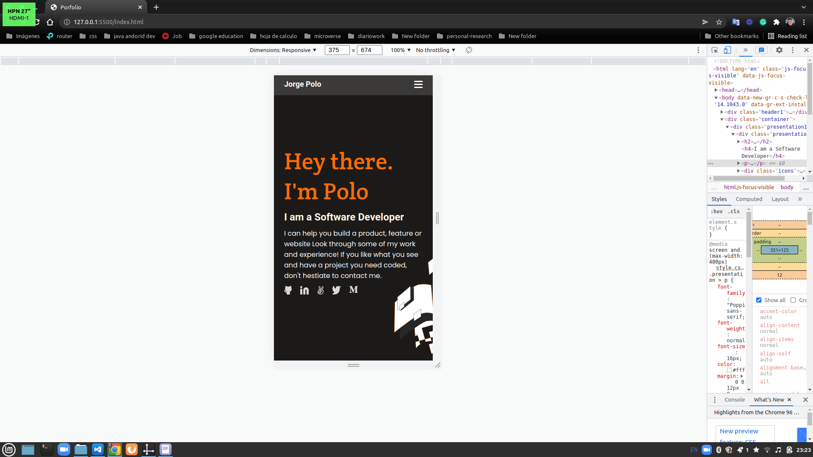

# Setup and Mobile Version Skeleton

> Mobile version of the Portfolio, must include 2 sections: the header and the headline.

Additional description about the project and its features.

## Built With

- Html 5
- Css 3
- Github as the version control system

## Live Demo

[Live Demo Link]( https://jpol01.github.io/Portfolio/)

## Getting Started

**This website is a mobile version. To get the best experience the min-width must to be 375px and a hegiht of 600px or more**

## Authors

👤 **Author1**

- GitHub: [@jpol01](https://github.com/jpol01)
- Twitter: [@Jpol1902](https://twitter.com/Jpol1902)

## 🤝 Contributing

Contributions, issues, and feature requests are welcome!

Feel free to check the [issues page](../../issues/).

## Show your support

Give a ⭐️ if you like this project!

## Acknowledgments

- Hat tip to anyone whose code was used
- Inspiration
- etc

## 📝 License

This project is [MIT](./MIT.md) licensed.
